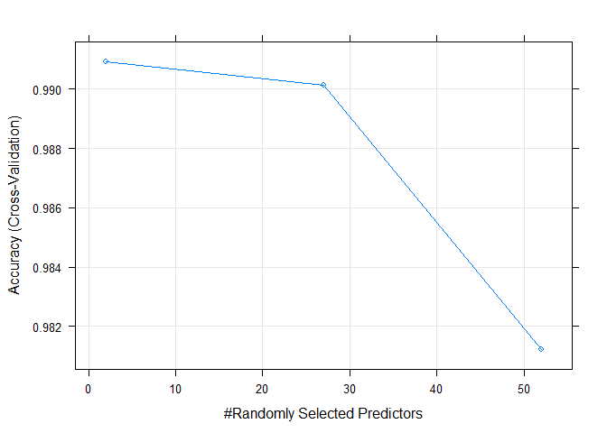
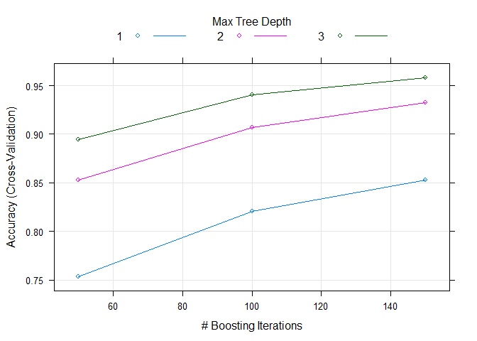

# Prediction the manner of people doing the exercise.
Yuriy Kotselko  
05 October 2017  


# Executive Summary
In this project we are going to analyse data from accelerometers on the belt, forearm, arm, and dumbell of  6 participants. Participants were asked to perform barbell lifts correctly and incorrectly in 5 different ways. Data came from this source http://groupware.les.inf.puc-rio.br/har#weight_lifting_exercises.

Our goal is to predict  the manner in which participants did the exercise. This is reflected by  "classe" variable in the training set. We are going to analyze provided training and testing set, select appropriate variables for our model and build the best fit model using machine learnig algorythms. In our case I would prefer to use Random Forest and Generalized Boost REgression and linear discriminant analysis Algorithm, compare their accuracy and select the best suitable algorithm.

#Data processing
##Loading the data

Let's assume that both "pml-training.csv" and "pml-testing.csv" are already located in Working directory. The following chunk of code will try to load the data into "training" and "testing" varibales respectively.


```r
if (!file.exists("pml-training.csv")) {
    stop("pml-training.csv not found in working directory.")
}
training <- read.csv("pml-training.csv", na.strings = c("NA","#DIV/0!"), header = TRUE)

if (!file.exists("pml-testing.csv")) {
    stop("pml-testing.csv not found in working directory.")
}
testing <- read.csv("pml-testing.csv", na.strings = c("NA","#DIV/0!"), header = TRUE)
```

##Analyzing the data
First of all lets take a quick look at the strucvture of both datasets:


```r
dim(training)
```

```
## [1] 19622   160
```

```r
dim(testing)
```

```
## [1]  20 160
```

###Exploratiry analysis:
Almost 20000 rows and 160 columns for the training dataset. What we are interested in is a "classe" variable and all the columns related to the data from accelerometers on the belt, forearm, arm, and dumbell of 6 participants. Testing dataset supposed to be used for prediction values for the final quiz, so let's live it apart for the time being.

It is clearly seen that many columns have lots of NA. Let's assume that columns with more than 60% of NA does not have much influence so we can ignore and remove them.


```r
training <- training[, !colMeans(is.na(training)) > 0.7]
dim(training)
```

```
## [1] 19622    60
```

Much better! Now let's use nearZeroVar function to identify and get rid of predictors with near zero variance:


```r
nearz <- nearZeroVar(training, saveMetrics = TRUE)
training <- training[, nearz$nzv == FALSE]
```

Reading the documFrom the documentation we can see that some fields, like record number, username, timestamp related data does not really related to our analysis. So, we can remove them as well as num_window column.


```r
training <- training[,!(names(training) %in% 
                            c("X","user_name","raw_timestamp_part_1","raw_timestamp_part_2","cvtd_timestamp","num_window"))]
dim(training)
```

```
## [1] 19622    53
```
Now when we get rid of all unecessary data, we can start playing with models.

#Building Models
##Split Samples
First of all let's split our training dataset into two, first will be training, and second will be kind of validation dataset we are going to evaluate our model with. This is kind of "split samples" approach.  60:40 is a good ratio for this kind of dataset.


```r
inTrain <- createDataPartition(training$classe, p=0.6, list = FALSE)
trainTraining <- training[inTrain, ]
testTraining <- training[-inTrain, ]
```

##Generating models
Let's create three different models: RandomForest, GBM and LDA. In order to improve performance we have to enable parralel processing using "parralel" package. We also select the resampling method "cv" for cross- validation and set the quantity of folds for k-folds cross-validation to 10.


```r
library(parallel)
library(iterators)
library(doParallel)
cluster <- makeCluster(detectCores() - 1)
registerDoParallel(cluster)

fitControl <- trainControl(method = "cv", number = 10, allowParallel = TRUE)
modrfTrain <- train(classe ~ ., method = "rf", 
                    data = trainTraining, trControl = fitControl)
modgbmTrain <- train(classe ~ ., method = "gbm", 
                     data = trainTraining, trControl = fitControl)
modldaTrain <- train(classe ~ ., method = "lda", 
                     data = trainTraining, trControl = fitControl)

modrfTrain$finalModel
modgbmTrain$finalModel
modgbmTrain$finalModel

stopCluster(cluster)
registerDoSEQ()
```

##Evaluation out-ssample errors
Now let's use our testTraining (validation) dataset to evalute out-of sample errors of all models. We will use Accuracy parametrer of cionfusionMatrix function for thios purpose. We will use the "predict" function to create a prediction of "classe" variable in "testTraining" dataset using all thre models created above:


```r
pred_rf <- predict(modrfTrain, testTraining)
pred_gbm <- predict(modgbmTrain, testTraining)
pred_lda <- predict(modldaTrain, testTraining)

confusionMatrix(testTraining$classe, pred_rf)$overall[1]
```

```
##  Accuracy 
## 0.9928626
```

```r
confusionMatrix(testTraining$classe, pred_gbm)$overall[1]
```

```
##  Accuracy 
## 0.9622738
```

```r
confusionMatrix(testTraining$classe, pred_lda)$overall[1]
```

```
##  Accuracy 
## 0.6975529
```

#Conclusions
As we can see, the Random Forest Model shows the best Accuracy. So it would be a good choice to be a final model. We will apply modrfTrain model to 20 cases available in "testing" dataset and will submit them to quiz. Just in case we will use to varImp function to ensure that all variables are protty important.


```r
varImp(modrfTrain)
```

```
## rf variable importance
## 
##   only 20 most important variables shown (out of 52)
## 
##                      Overall
## roll_belt            100.000
## pitch_forearm         58.818
## yaw_belt              50.008
## roll_forearm          44.847
## magnet_dumbbell_y     43.182
## pitch_belt            42.171
## magnet_dumbbell_z     42.086
## accel_dumbbell_y      22.499
## accel_forearm_x       17.200
## roll_dumbbell         17.110
## magnet_belt_z         16.446
## magnet_dumbbell_x     16.373
## accel_belt_z          14.614
## magnet_forearm_z      13.948
## accel_dumbbell_z      13.914
## total_accel_dumbbell  12.748
## magnet_belt_y         11.963
## yaw_arm               10.227
## magnet_belt_x         10.156
## gyros_belt_z           9.183
```

```r
pred_final <- predict(modrfTrain, testing)
pred_final
```

```
##  [1] B A B A A E D B A A B C B A E E A B B B
## Levels: A B C D E
```

\pagebreak

#Annex 1


```r
plot(modrfTrain)
```

<!-- -->

```r
plot(modgbmTrain)
```

<!-- -->
